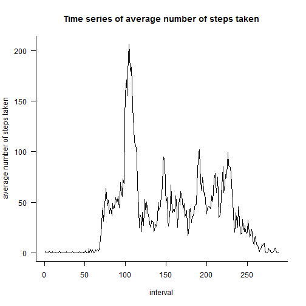
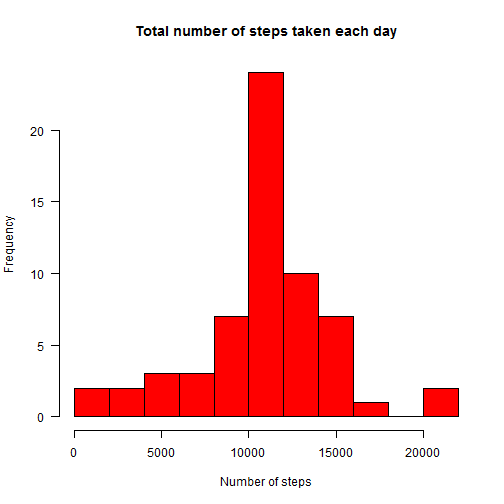
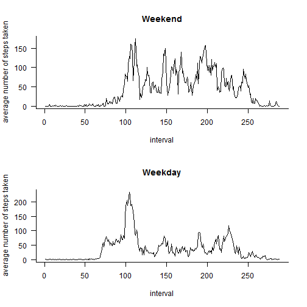

<!-- rmarkdown v1 -->
# Reproducible Research: Peer Assessment 1

https://github.com/dbatorski/RepData_PeerAssessment1

## Loading and preprocessing the data


Code to load the data:

```r
if(!file.exists("activity.csv")) unzip("activity.zip")
activity <- read.csv("activity.csv", colClasses=c("integer", "Date", "integer"))
head(activity)
```

```
##   steps       date interval
## 1    NA 2012-10-01        0
## 2    NA 2012-10-01        5
## 3    NA 2012-10-01       10
## 4    NA 2012-10-01       15
## 5    NA 2012-10-01       20
## 6    NA 2012-10-01       25
```

Process/transform the data (if necessary) into a format suitable for your analysis

```r
attach(activity)
day = strftime(as.Date(date, "%Y-%m-%d"),format="%m-%d")
```


## What is mean total number of steps taken per day?

A histogram of the total number of steps taken each day

```r
# First calculate a sum of number of steps taken per day (steps.perday)
steps.perday = tapply(steps, INDEX=day, FUN=sum, na.rm=T)
hist(steps.perday, las=1,col=4,breaks=9,
     main='Total number of steps taken each day',xlab='Number of steps')
```

 


```r
dsmean <- mean(steps.perday)
dsmedian <- median(steps.perday)
```
Mean total number of steps taken per day is 9354.2295.

Median total number of steps taken per day is 10395.


## What is the average daily activity pattern?

A time series plot of the 5-minute interval (x-axis) and the average number of steps taken, averaged across all days (y-axis)


```r
# First calculate an average number of steps taken per 5-min interval (steps.perint)
steps.perint = tapply(steps, interval, FUN=mean, na.rm=T)
plot(steps.perint, type='l', las=1, bty='l',
     main='Time series of average number of steps taken', xlab='interval', ylab='average number of steps taken')
```

 

Which 5-minute interval, on average across all the days in the dataset, contains the maximum number of steps?

```r
maxintval <- names(steps.perint[steps.perint==max(steps.perint)])
maxintval
```

```
## [1] "835"
```
Interval 835 has the maximum number of steps.


## Imputing missing values

Calculate and report the total number of missing values in the dataset.

```r
#sum(is.na(date))
#sum(is.na(interval)) # missing data are only in steps variable
misval <- sum(is.na(steps))
misval
```

```
## [1] 2304
```
There is 2304 missing values in the data set.

The strategy for filling in the missing values in the dataset is to impute them using the average number of steps taken per 5-minute interval across all days.
A new variable steps2 is created that is equal to the original but with the missing data filled in.

```r
steps2 = steps
for (i in 1:length(steps)){
     if (is.na(steps[i])){
          steps2[i]= steps.perint[row.names(steps.perint)==interval[i]]
     }
}
```

A histogram of the total number of steps taken each day 

```r
steps2.perday = tapply(steps2, INDEX=day, FUN=sum, na.rm=T)
hist(steps2.perday, las=1,col=2,breaks=9,
     main='Total number of steps taken each day',xlab='Number of steps')
```

 

The mean and median total number of steps taken per day. 

```r
ds2mean <- round(mean(steps2.perday),2)
ds2median <- median(steps2.perday)
```
Mean total number of steps taken per day is 1.0766 &times; 10<sup>4</sup>.
Median total number of steps taken per day is 1.0766 &times; 10<sup>4</sup>.
Both values are larger from the estimates from the first part of the assignment. Due to the imputation of the missing data, the estimates of the total daily number of steps has increased.


## Are there differences in activity patterns between weekdays and weekends?

A new factor variable in the dataset with two levels – “weekday” and “weekend” indicating whether a given date is a weekday or weekend day.

```r
weekd <- weekdays(as.Date(date, "%Y-%m-%d"),abbreviate=T)
weekd2 = replace(weekd, weekd=='N',"weekend")
weekd2 = replace(weekd2, weekd=='So',"weekend")
weekd2 = replace(weekd2, weekd2!="weekend","weekday")
```

A panel plot containing a time series plot of the 5-minute interval (x-axis) and the average number of steps taken, averaged across all weekday days or weekend days (y-axis). 

```r
ts.steps2.wend = tapply(steps[weekd2=="weekend"], interval[weekd2=="weekend"], 
                      FUN=mean, na.rm=T)
ts.steps2.wday = tapply(steps[weekd2=="weekday"], interval[weekd2=="weekday"], 
                      FUN=mean, na.rm=T)

split.screen(c(2,1))
```

```
## [1] 1 2
```

```r
screen(1)
plot(ts.steps2.wend, type='l', las=1, bty='l',
     main='Weekend', xlab='interval', ylab='average number of steps taken')
screen(2)
plot(ts.steps2.wday, type='l', las=1, bty='l',
     main='Weekday', xlab='interval', ylab='average number of steps taken')
```

 

```r
close.screen(all.screens=T)
```

